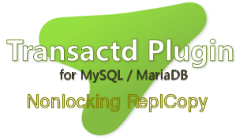

Nonlocking Replcopy
===============================================================================


Nonlocking ReplcopyはTransactd-Pluginを使用したMySQL/MariaDB用レプリケーション
セットアップと修復コピーを無停止かつロックなしで行うためのPHPスクリプトです。

このスクリプトで、マスターからスレーブへのデータのコピーとレプリケーションの開始
処理を行えます。既に稼働しているレプリケーションでの不一致解消のために、一部のテ
ーブルやデータベースのみを修復コピーすることも可能です。
さらに、セットアップと修復時にマスターの停止やテーブルロックは不要です。マスター
の機能を制限することなく稼働したまま処理できます。
MySQL / MariaDBの両方のGTIDに対応しています。


## 詳細
Replcopyは修復コピーにおいて、マスターとスレーブに矛盾が生じないようにTransactd
の`nsdatabase::beginSnapshot()`APIを使います。このメソッドはバイナリログポジショ
ン取得と同時にコピーのためのスナップショットを開始します。
その後、スレーブにそのポジションを指定した`START SLAVE UNTIL`を行って双方のデー
タを同期させた上で、スレーブを停止しコピーを行います。
これによりMySQLのコマンドでは実現できない、完全なテーブルロックフリーによるマス
ターとスレーブのデータ同期を可能にしています。


## デモ
実際にスクリプトを実行したときの画面です。
`test_v3`という名前のデータベースをコピーしてレプリケーションを修復しています。
実行中に処理したレプリケーション関係のコマンド、コピーしたデータベースとテーブル
名などがエコーされます。
最後に`Slave_IO_Running`と`Slave_SQL_Running`が検査されます。

```
[replcopy]# php dreplcpy.php ./repl_config_centOS.ini
Nonlocking replcopy version 1.0.0
--- Start replication setup  ---
Open slave database ...  done!
Stop slave ...  done!
Open master database ...  done!
Open master tables ...  done!
Begin snapshot on master ...  done!
Wait for stop slave until binlog pos ...  done!
Copying tables ...
  [database : test_v3]
    table : fieldtest ...  done!
    table : groups ...  done!
    table : nullkey ...  done!
    table : nullvalue ...  done!
    table : packrecord_test ...  done!
    table : scores ...  done!
    table : setenumbit ...  done!
    table : test ...  done!
    table : timetest ...  done!
    table : users ...  done!
Reset slave ...  done!
Change master ...
        set global gtid_purged='d30d02d6-3fe4-11e5-97db-00ffa4dbde57:1-8';
        change master to master_host='server1', master_port=3306, master_user='replication_user', master_password='123', master_auto_position = 1;  done!
Start slave ...  done!
Slave_IO_Running = Yes
Slave_SQL_Running = Yes
--- Replication setup has been completed ---
[replcopy]#
```


## 主な特徴
* マスターを停止したりテーブルロックしたりせずに稼働したまま、マスター/スレーブ
  間で矛盾を起こさないセットアップが可能
* データのコピーはマスターからスレーブにダイレクトに転送するため、一時ファイルの
  コピーといった操作が不要
* Transactd APIで高速な読み取り書き込みを行うため、mysqldumpによるダンプとイン
  ポートより高速に処理できる
* コピーするデータは、サーバー全体、複数の選択したデータベース、1つのデータベー
  スの選択したテーブル、の3つから選択できる
* 修復コピーの際にSQLスレッドエラーのスキップ処理が対話的に行える
* MySQL/MariaDB両方のGTIDレプリケーションに対応
* スクリプトを実行するホストはマスターローカル・スレーブローカル・リモートいずれ
  でも可
* ビューもコピーできる


## 実行環境
* OS : Linux / Windows / Mac OSX
* PHP: 5.x / 7.0 （WindowsのPHP5は5.5以上）
* Transactd: バージョン 3.4.1以上（サーバープラグイン・クライアントの両方）
* MySQL 5.5以上 / MariaDB 5.5以上
  （MariaDB 10.0.8〜10.0.12はバグがあるため使用不可）（MySQLクライアントは不要）


## 制限事項
* InnoDBのテーブルを対象にしています。MyISAMなど非トランザクショナルなテーブルは
  コピー中にマスターに変更があると、スレーブとの間で矛盾が生じることがあります。
* サーバー全体コピーではmysqlデータベースは除外されます。だだし、mysqlデータベー
  スのみを指定したコピーは可能です。
* tablesパラメータによるテーブル指定で、ビューは指定できません。


## 使い方
```
php replcopy.php repl_config.ini
```
レプリケーションに関する設定はすべてiniファイルで行います。replcopy.phpへの引数
はこのiniファイル名のみです。

`START SLAVE UNTIL`でSQLスレッドにエラーがある場合は、そのエラーをスキップするか
どうかを問い合わせるプロンプトが表示されます。選択肢はY/A/Cの3つです。
* Yを選択すると最後の1つのエラーのみスキップされます。
* Aはすべてのエラーをスキップします。
* Cはこのスクリプトの実行をキャンセルします。

Aのすべてのエラーをスキップでは、 *`RESET SLAVE`を実行してリレーログをすべて削除
します。この場合、リレーログにコピー対象以外のテーブルのトランザクションがあると
それはスレーブに反映されません。そのようなログがあると想定される場合は、Aを選択
しないでください。*


### repl_config.ini
#### サンプル
```
[master]
host=server1:8610
repl_port=3306
repl_user=replication_user
repl_passwd=*

databases=test_v3
tables=
ignore_tables=

[slave]
host=server2:8610
master_resettable=1
log_bin=1

[gtid]
using_mysql_gtid=1
type=2
```

#### master セクション
マスターサーバーの情報を設定します。`passwd`または`repl_passwd`に`*`を指定する
と、実行時入力プロンプトで指定できます。

* `host`          : ホスト名またはIPアドレス + Transactdポート番号
  （例 server1:8610）
  （ポートを省略するとデフォルトの8610）
   マスターホストにはlocalhostは指定しないこと。スレーブからアクセス可能なホスト
   名またはIPアドレスである必要がある。
* `user`          : Transactdアクセスのためのユーザー名
* `passwd`        : userのパスワード
* `repl_port`     : MySQLのポート番号
* `repl_user`     : レプリケーションユーザー名
* `repl_passwd`   : repl_userのパスワード
* `databases`     : コピーするデータベース。カンマで区切って複数指定可能 
  （省略するとすべてのデータべース）
* `tables`        : databasesに1つのデータベースを指定した場合に、その中のコピー
  するテーブル名。カンマで区切って複数指定可能（省略するとすべてのテーブル。
  ビューは指定できない。）
* `ignore_tables` : コピーをスキップするテーブル名またはビュー名。カンマで区切っ
  て複数指定可能（省略可能）

#### slave セクション
スレーブサーバーの情報を設定します。`passwd`に`*`を指定すると、実行時入力プロン
プトで指定できます。

* `host`              : ホスト名またはIPアドレス + Transactdポート番号
  （例 server2:8611）（ポートを省略するとデフォルトの8610）
* `user`              : TransactdアクセスとスレーブコントロールのためのSUPER権限
  を持つユーザー名
* `passwd`            : userのパスワード
* `master_resettable` : 0か1。MySQLのGTIDモードのとき、スレーブで`RESET MASTER`
  を行ってもよいかどうか。このスレーブがマスターでもある場合は0を指定する。 
  [gtid]セクションで`type=2`を指定した場合のみ有効。
* `log_bin`           : スレーブのバイナリログをコピー時有効にするかどうか。この
  スレーブがマスターでもある場合は1を指定する。

#### GTID セクション
レプリケーションのGTIDに関する情報を設定します。

* `using_mysql_gtid`  : スレーブが現在`gtid_mode=on`でレプリケーションを使用して
  いるかどうか。`0`はGTIDを使っていない。`1`は使用中。このパラメータはMariaDBの
  場合は無視される。
* `type`              : GTIDを使ったポジションを使用するかどうか。
  `0`はGTIDでのポジション指定しない。`1`はMariaDBのGTID、`2`はMySQLのGTID。


## インストール
サーバーにはマスター・スレーブともTransactdプラグイン3.4.1以上が必要です。以下
よりダウンロードとインストールを行ってください。

* [Transactd download]
(http://www.bizstation.jp/al/transactd/download/index.html)

また、以下を参照して、スクリプトを実行するホストにTransactd PHPクライアント
3.4.1以上をインストールします。

* [Transactd インストールガイド for PHP]
(http://www.bizstation.jp/ja/transactd/documents/install_guide_php.html)

`php/dreplcpy.php`をPHPが実行可能フォルダに保存します。

`repl_config.ini`を編集してレプリケーションの設定を行ってください。


## バグ報告・要望・質問など
バグ報告・要望・質問などは、[github上のIssueトラッカー](
https://github.com/bizstation/dreplcopy/issues)にお寄せください。


## ライセンス
GNU General Public License Version 2
```
   Copyright (C) 2016 BizStation Corp All rights reserved.

   This program is free software; you can redistribute it and/or
   modify it under the terms of the GNU General Public License
   as published by the Free Software Foundation; either version 2
   of the License, or (at your option) any later version.

   This program is distributed in the hope that it will be useful,
   but WITHOUT ANY WARRANTY; without even the implied warranty of
   MERCHANTABILITY or FITNESS FOR A PARTICULAR PURPOSE.  See the
   GNU General Public License for more details.

   You should have received a copy of the GNU General Public License
   along with this program; if not, write to the Free Software 
   Foundation, Inc., 59 Temple Place - Suite 330, Boston, MA  
   02111-1307, USA.
```
